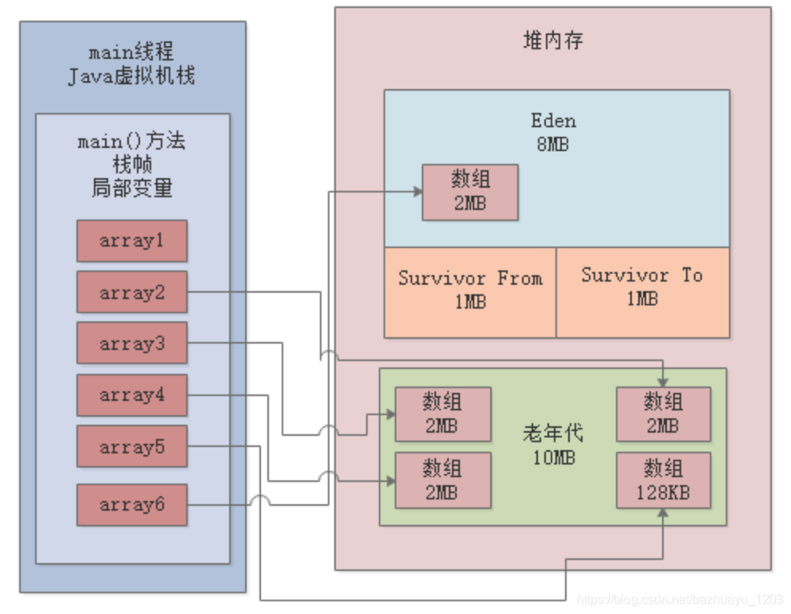

# jvm_gc_test
模拟测试JVM GC(java8)


# 启动参数
- 10485760 = 10 * 1024 * 1024 = 10M
- 3145728 = 3 * 1024 * 1024 = 3M
- 老年代内存 = 堆内存 - 新生代内存
```
-XX:NewSize=10485760 初始新生代内存 -Xmn
-XX:MaxNewSize=10485760 最大新生代内存
-XX:InitialHeapSize=20971520 初始堆内存 -Xms
-XX:MaxHeapSize=20971520 最大堆内存 -Xmx
-XX:SurvivorRatio=8 Eden比S区（s0或s1）
-XX:MaxTenuringThreshold=15 经历15次YGC才会晋升到老年代
-XX:PretenureSizeThreshold=3145728 超过此值对象直接在老年代分配内存
-XX:+UseParNewGC
-XX:+UseConcMarkSweepGC
-XX:+PrintGCDetails
-XX:+PrintGCTimeStamps
-Xloggc:gc.log
```

# GC分析
- **YoungGC触发条件**：当新生代的Eden区满了之后就会触发YoungGC
- **FullGC触发条件**：
  - 1、发生Young GC之前进行检查，如果“老年代可用的连续内存空间” < “新生代历次Young GC后升入老年代的对象总和的平均大小”，说明本次Young GC后可能升入老年代的对象大小，可能超过了老年代当前可用内存空间，此时会触发FullGC
  - 2、当老年代没有足够空间存放对象时，会触发一次FullGC
  - 3、如果元空间区域的内存达到了所设定的阈值-XX:MetaspaceSize=，也会触发FullGC。


